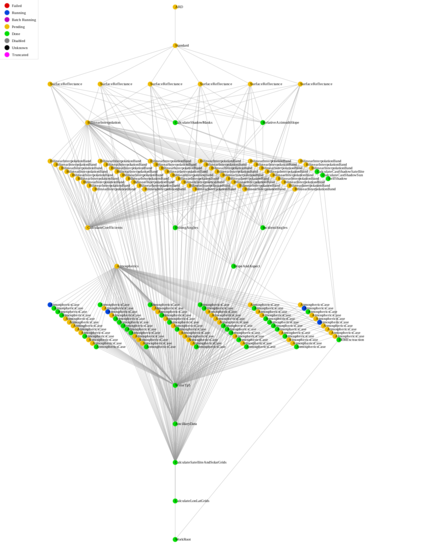

# gaip
------

gaip is a Python package for producing standarised imagery in the form of:

* Nadir Bi-directional Reflectance Distribution Function Adjusted Reflectance (NBAR)
* NBART; NBAR with Terrain Illumination correction
* Surface Brightness Temperature
* Pixel Quality (per pixel metadata)

The luigi task workflow for producing NBAR for a Landsat 5TM scene is given below.

## Supported Satellites and Sensors
-----------------------------------
* Landsat 5 TM
* Landsat 7 ETM
* Landsat 8 OLI
* Landsat 8 TIRS
* Sentinel-2a

## Requirements
---------------
* [luigi](https://github.com/spotify/luigi)
* [numpy](https://github.com/numpy/numpy)
* [scipy](https://github.com/scipy/scipy)
* [numexpr](https://github.com/pydata/numexpr)
* [pyephem](http://rhodesmill.org/pyephem/)
* [proj](https://github.com/OSGeo/proj.4)
* [h5py](https://github.com/h5py/h5py)
* [bitshuffle](https://github.com/kiyo-masui/bitshuffle)
* [tables](https://github.com/PyTables/PyTables)
* [pandas](https://github.com/pandas-dev/pandas)
* [scikit-image](https://github.com/scikit-image/scikit-image)
* [GDAL](https://github.com/OSGeo/gdal)
* [rasterio](https://github.com/mapbox/rasterio)
* [fiona](https://github.com/Toblerity/Fiona)
* [shapely](https://github.com/Toblerity/Shapely)
* [geopandas](https://github.com/geopandas/geopandas)
* [pyyaml](https://github.com/yaml/pyyaml)
* [mafisc compression](https://wr.informatik.uni-hamburg.de/research/projects/icomex/mafisc)

See [requirements.txt](requirements.txt) for specific version details.

## Installation
---------------

### Requirements
Installing the base requirements is done via pip:
`$ pip install -r /path/to/requirements.txt`

### Mafisc compression filter
To install the `mafisc` compression filter, follow these [instructions](https://wr.informatik.uni-hamburg.de/research/projects/icomex/mafisc).
Or basic instructions are:

`$ make install --prefix=<prefix>` to install into your own `<prefix>`.
If specifying your own `<prefix>`, then set the following path:

`$ export HDF5_PLUGIN_PATH=<prefix>`

This allows HDF5 to use [dynamically loaded filters](https://support.hdfgroup.org/HDF5/doc/Advanced/DynamicallyLoadedFilters/HDF5DynamicallyLoadedFilters.pdf).

### gaip Package
The gaip pacakage can be installed via:

`$ python setup.py install --prefix=<prefix>`

## Basic commanline useage
--------------------------
Using the [local scheduler](http://luigi.readthedocs.io/en/stable/command_line.html):

    $ luigi --module gaip.standard_workflow ARD --model nbar --level1-list scenes.txt --outdir /some/path --local-scheduler --workers 4

Using the [central scheduler](http://luigi.readthedocs.io/en/stable/central_scheduler.html):

    $ luigid --background --pidfile <PATH_TO_PIDFILE> --logdir <PATH_TO_LOGDIR> --state-path <PATH_TO_STATEFILE>

    $ luigi --module gaip.standard_workflow ARD --level1-list scenes.txt --model standard --outdir /some/path --workers 4

    $ luigi --module gaip.standard_workflow ARD --level1-list scenes.txt --model nbar --outdir /some/path --workers 4

    $ luigi --module gaip.standard_workflow ARD --level1-list scenes.txt --model sbt --outdir /some/path --workers 4
