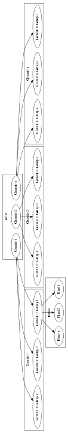

Acquisitions
============

The core class for the wagl package is the *Acquisition* object. An *Acquistion* contains much of the required information about the spectral band,
but also the satellite, sensor, datetime, gain, bias, spectral reponse etc.

An *Acquisition* instance is created for every band contained within a given group, such as a particular resolution.
The *Acquisition* contains geospatial context, and has direct read access to the spectral band that the *Acquisition* refers to.

From a top down perspective, a dataset contains one or more granules, and each granule contains 1 or more resolution *Groups*. The *AcquisitionsContainer*
is the class object containing all of this together, and can be thought of as similar to a HDF5 file which itself is structured similar to a UNIX directory.
This HDF5 stylisation is part of the design choice in moving to using HDF5 as the main backend for the algorithmic workflow, in that similar concepts and model designs can be
shared throughout the codebase.

A dataset can be thought of as the root (/) level, followed by *Granules*.
Each *Granule* ID can contain multiple resolution *Groups*, each of which contains 1 or more *Acquisitions*, each *Acquisition* instance is a direct reference to a given spectral band available
for that resolution group.

A *Granule* represents the spatial extent for which any *Acquisition* would cover, which in the case of Landsat is the entire dataset;
whereas for Sentinel-2 A & B, it is a sub-portion/subset of the dataset.

The ID for a *Granule* is taken from the metadata packaged with the product, which in the case of Landsat is the MTL file,
and the ID is taken from *LANDSAT_SCENE_ID*. For Sentinel-2 A & B, the *Granule* ID's are read from the main xml file.

The resolution *Groups* are listed in order from highest resolution to lowest resolution.
The *Group* naming format is given by RES-GROUP-{} eg RES-GROUP-0, RES-GROUP-1, ..., RES-GROUP-N-1,
with RES-GROUP-0 being the highest resolution.

The following picture describes the rough layout of an *AcquisitionsContainer*.

* *AcquisitionsContainer.granules* Returns the *Granule* names associated with the dataset.
* *AcquisitionsContainer.groups* Returns the *Group* names associated with the dataset.

* *AcquisitionsContainer.get_acquisitions* Given a *Granule* and *Group*, return a list of *Acquisition* objects.
* *AcquisitionsContainer.get_granule* Returns a *dictionary* containing lists of *Acquisition* objects for each *Group* associated with the given *Granule*.
* *AcquisitionsContainer.get_root* Return a *str* to the root level for a given *Granule* and *Group*. Example:

       .. code-block:: python

          >>> container = acquisitions('S2A_USER_PRD_MSIL2A_PDMC_20160120T071902_R016_V20160120T003331_20160120T003331.SAFE')
          >>> print(container.get_root('my/work/directory', granule='S2A_USER_MSI_L2A_TL_SGS__20160120T053143_A003016_T55KBQ_N02.01', group='RES-GROUP-0')

An *Acquisition* instance also defines the tiling/chunking logic of any given image processing routine, as well as how the image result is stored on disk.
This is to provide a more dynamic and flexible processing capability for a variety of sensors that become supported by wagl.
The property `tile_size` describes the underlying storage tiles for the acquisition, and the method `tiles` returns a tile generator that can be looped over
and return a tile/chunk of data for processing.
